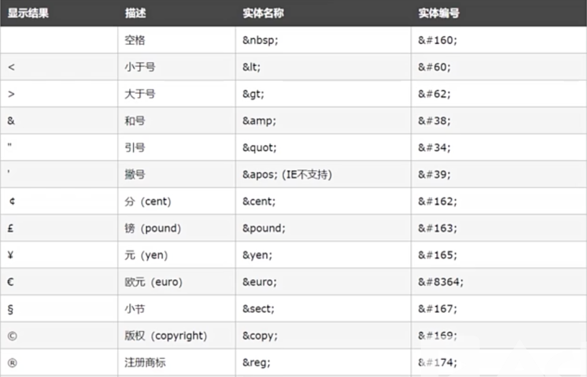

# 05.1-HTML 进阶总结

## 一 常用标签总结

### 1.1 HTML4 常见标签总结

```txt
一些基础：html、head、body、h1-h6、p、br、hr、<!---->
文本相关：strong、b、em、i、small、del、sub、sup
链接相关：a、link
图片相关：img、map、area
区块相关：div、span
列表相关：ul、ol、li、dl、dt、dd
表格相关：table、caption、th、tr、td、thead、tbody、tfoot
框架相关：iframe
表单相关：form、input、select option、textarea、button、label
实体相关：&lt;、&gt;、&copy;、&nbsp;
```

### 1.5 HTML5 新增标签总结

===TODO===

## 二 标签语义化

> 标签语义化：对文本内容的结构，选择合乎语义的标签，从而让代码便于理解阅读

标签语义化可以辅助爬虫更好的解析 HTML 文档，对提升 SEO 有一定的作用。

## 三 HTML 网页代码优化

### 3.1 常见规范

采用 HTML5 标准开头 `<!DOCTYPE html>`。

CSS 推荐在 head 标签中引入，以让浏览器在输出 HTML 之前获取到样式信息，正确展示。

在 body 标签末尾引入 js 文件，即页面显示后再载入脚本，可以加快页面呈现给用户的速度，也能正确让 js 操作页面中的元素。

元素的操作应该写在 js 代码中，极度不推荐直接写在 html 中。

开发中使用代码检查工具能够很好的检验代码规范。

样式推荐使用 css。

标题标签推荐使用 h1-h6。

table 一定要使用 caption 设置表格题目。

br 标签一般只用于文本内换行。

### 3.2 标签嵌套规范

块级元素可以包含内联元素或者某些块级元素，但是内联元素不能包含块级元素，只能包含其他内联元素。

一些特殊的标签只能包含内联元素：h1-h6、p、dt。

ul 与 li，ol 与 li，dl 与 dt、dd 等有父子关系，父级下只能有其对应子标签。

a 标签不能嵌套 a 标签。

```html
<!--正确写法-->
<div><p></p></div>

<!--正确写法-->
<a><span></span></a>

<!--错误写法-->
<span><div></div></span>

<!--错误写法-->
<p><ol></ol></p>

<!--错误写法-->
<ul><div></div><li></li></p>
```

## 四 HTML 中的实体与实体编号



## 五 编辑器的 emmet 语法

emmet 语法用于提升编辑器的操作速度，笔者这里是 vscode：

- 输入 div，tab 键可以直接输入完整的 div 标签
- 输入 html，tab 键可以直接输入完整的 html 文档
- 输入 div\*3，tab 键可以直接输入 3 个 div
- 输入 ul>li\*3， tab 键可以输入 ul/li，并有 3 个 li
- 输入 div+p， tab 键可以输入 div 与 p 两个兄弟节点
- 输入 .demo， tab 键可以直接输入 `<div class="demo"></div>`，类似的也支持 #
- 输入 .demo\$\*3， tab 键可以为 class 类名做自增， class=demo1
