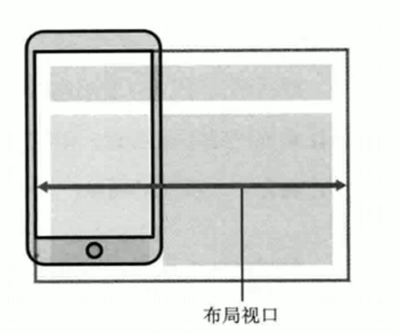

## 一 移动 web 开发概念

### 1.1 视口

移动 web 开发即针对移动端的浏览器进行 web 开发，目前移动端浏览器内核主要为 webkit 内核。

PC 端的页面直接放置在手机端显示，由于页面过大无法显示全，就会出现滚动条，为了解决该问题，引入了 视口。

> 视口：viewport，即浏览器 显示页面内容的屏幕区域，分为 布局视口、视觉视口、理想视口

布局视口：在手机中，一般会默认会有一个 980px 分辨率的视口，所以 PC 端网页一般都可以显示在手机中，但是此时 PC 端的页面在手机端看起来就会变小。



视觉视口：用户在手机端能看到的页面区域。


理想视口：我们希望能够在视觉视口内全部显示完内容，又不会像布局视口那样大（不需要手指捏着屏幕看）。

为了实现理想视口，需要手动添加 meta 视口标签 通知浏览器操作，该标签的目的是让布局视口的宽度和理想视口的宽度一致，即设备有多宽，布局的视口就有多宽。

视口示例：

```txt
<meta name="viewport" content="width=device-width, initial-scale=1.0" />
```

content 常见属性：

```
width               默认为device-width，即为理想视口，如果不加，默认按照 980px 显示，页面元素就会变得很小
user-scalable       是否允许用户缩放
initial-scale       最初的缩放比例，比如值为2，则页面一打开，缩放为默认大小的2倍显示
```

标准的 viewport 设置推荐如下：

```
视口宽度和设备保持一致
视口的默认缩放比例为1.0
不允许用户自行缩放
最大允许缩放比例为1.0
最小允许缩放比例为1.0
```

### 1.2 倍图

**物理像素**：屏幕显示的最小颗粒，即分辨率，如 ihpnoe7 分辨率为： 1334\*750，那么 750 就是物理像素，在 iphone 的屏幕中，一行拥有 750 个像素点，高度上一列拥有 1334 个像素点。

在 PC 端，1px 就是 1 个物理像素，但是在移动端，一个 px 能显示的物理像素点的个数，被称为物理像素比/屏幕像素比。比如在 PC 端宽为 375px 的一个 div，在 iphone 中显示却超出了整个 iphone 屏幕，这是因为 1px 在 iphone8 的占据 2 个物理像素，其实际宽度为 750px。

移动端之所以要这样疯狂为屏幕提升物理像素，是为了让其显示的更加清晰！但是这样做图片就会出现问题：50px\*50px 的图片到了 iphone8 就会被放大两倍，反而变得模糊了。

在标准视口设置中，一般使用倍图来解决图片在视网膜屏中变模糊的问题，如上述`50px*50px`的 PC 端图片，需要一个 `100px*100px`图片，并将该图片手动缩小为`50px*50px`适配 iphone8。

cutterman 工具可以用来快速切倍图

### 1.3 背景缩放

CSS3 中的 `background-size`属性可以设置背景图像的尺寸:

```css
/* 分别是背景图宽度 高度的缩放 */
background-size: 100px 200px;

/* 只写一个参数则是 宽度缩放,高度则会按照等比例缩放 */
background-size: 100px;

/* 相当于父盒子进行比例缩放 */
background-size: 20%;

/* cover: 将图像沿着两个方先无限拉伸盖住盒子,图片会出现被遮挡部分 */
background-size: cover;

/* contain: 将图像等比例拉伸,宽度或者高度有一个铺满盒子,图片会完整显示,但是可能不会完全覆盖为背景 */
background-size: contain;
```

## 二 移动端 web 技术方案

### 2.1 移动 web 开发方式

移动端 web 开发有两种选型方案:

- 单独制作移动端页面:这是主流方案,在网页中加入类似 `m.jd.com` ,根据打开设备不同来专门展示移动端界面
  - 常见技术方案包括:流式布局(百分比布局)/天性布局/less+rem+媒体查询/混合布局
- 响应式页面:利用兼容设置来兼容移动端.开发一个页面,根据屏幕宽度进行响应式适配,开发难度较大
  - 常见技术方案:媒体查询/bootstrap

### 2.1 常见移动端注意事项

移动端浏览器内核一般为 webkit 内核,可以较大范围的使用 C3 技术.

初始化移动端的 css,推荐使用第三方库:`normalize.css`,该库保留了一些有价值的默认值,修改了一部分浏览器 bug,且具备模块化开发方案.
