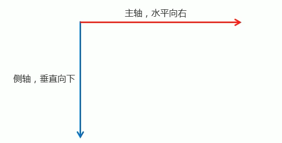

## 一 Flex 布局

Flex（Flexible Box）即弹性布局（也称为伸缩布局），为盒模型提供了最大的灵活性，任何一个容器都可以指定为 flex 布局。

Flex 布局与传统布局的对比：

- 兼容性：传统布局兼容性更好，Flex 布局适合移动端，在 PC 端支持较差，IE11 以上才能获得部分支持
- 布局：Flex 布局更加简单便利

Flex 布局的使用方式:

```css
div {
  display: flex;
}
```

被设置为 flex 的的盒子称呼为容器（flext container），其子元素都会自动称为容器成员（flext item）。 此时整体布局方式采用弹性伸缩机制，所以子元素也不再依赖于 float、clear、vertical-align 等属性，所以这些属性也相应的失效了。

> Flex 布局原理：通过给父盒子添加 flex 属性，控制子盒子的位置和排列方式

## 二 Flex 布局的实现

### 2.0 主轴与侧轴

如图所示：



在 flex 布局中，有两个方向（默认方向是可以改变的）：

- 主轴：默认是 x 轴，水平向右。
- 侧轴：默认是 y 轴，水平向下

元素会跟着主轴进行排列，通过 flex-direction 来设置主轴是哪个轴（方向），设置了主轴之后，剩下的就是侧轴！

```css
        div {
            display: flex;
            width: 800px;
            height: 300px;
            background-color: pink;
            /* 默认主轴为row，即x轴，此时可以不写该属性，column为y轴*/
            flex-direction: column;
        }

        div span {
            width: 150px;
            height: 100px;
            background-color: greenyellow;
        }

    <div>
        <span>1</span>
        <span>2</span>
        <span>3</span>
    </div>
```

### 2.1 父元素的常见属性

在 flex 布局中，父元素常见的属性：

- flex-direction：设置主轴的方向
  - row：是默认值，从左到右排列，即 x 轴方向
  - row-reverse：从右到左排列
  - column：从上到下排列，即 y 轴方向
  - column-reverse：从下到上排列
- justify-content：设置主轴的子元素排列方式
  - flex-start：默认值，表示从头开始，即如果主轴为 x 轴，则是从左到右排列
  - flex-end：从尾部开始排列
  - center：在主轴方向居中对齐，如果主轴是 x 轴，则水平居中
  - space-around：平分剩余空间
  - space-between：**先两边贴边，再评分剩余空间**！！！！！
- flex-wrap：设置子元素是否换行
  - nowrap：不换行，默认会在主轴上排成一条线
  - wrap：换行
- align-items：设置侧轴上的子元素排列方式（单行），如果主轴为 x，则侧轴为 y
  - flex-start：默认值，从上到下
  - flex-end：从下到上
  - center：挤在一起居中对齐
  - stretch：沿着侧轴拉伸，此时子盒子无需设置高度，因为会直接拉伸满直到达到父盒子高度
- align-content：用来设置侧轴上的子元素排列方式，适用于子项出现换行的情况，在单行下无效
  - flex-start：默认值，从侧轴的头部开始排列
  - flex-end：从侧轴的尾部开始排列
  - center：在侧轴的中间显示
  - space-around：子项在侧轴平分剩余空间
  - stretch：设置子项元素高度平分父元素高度
- flex-flow：复合属性，相当于同时设置了 flex-direction 和 flex-wrap，示例：`flex-flow: row wrap`

align-items 和 align-content 对比：

- align-items 适用于单行情况，只有上下对齐、居中和拉伸
- align-content 适用于多行，可以设置上下对齐、居中、拉伸，平均分配剩余空间

### 2.2 子元素常见属性

flex 属性：用户来定义子项目分配**剩余空间**的份数

```css
.item {
  flex: 1; /* 默认值为0, 这里1表示剩余空间被分为1份，当前元素.item占据了这一份 */
}
```

示例：

```css
/* p中有三个span，span没有宽度*/
p span {
  flex: 1; /* span没有宽时p的剩余宽度就是全部宽度，所以span会被三等分 */
}

p span:nth-child(2) {
  flex: 2; /* 额外加上这条之后，p会被四等分，第二个span会获得2份，前后span只获得一份 */
}
```

子项的其他属性：

- aligm-self：控制自己在侧轴上的排列方式，可以覆盖 align-items 属性
  - auto：默认值，表示继承父元素的 align-items 属性，如果没有父元素，则等同于 strech
