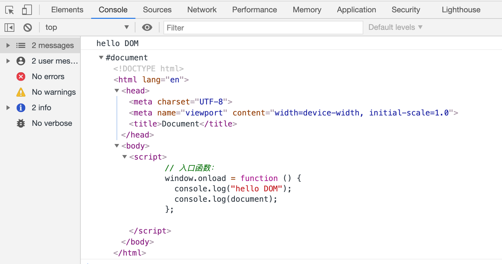

# DOM 概述

## 一 理解 DOM 与 Bom

ECMAScript 是 JavaScript 的语法核心，但是仅仅有语法，没有一些具体的 API 帮助，JS 也只是一个玩具。在浏览器环境中，浏览器为 JavaScript 提供了两大对象：

- DOM：`Document Object Model`，JavaScript 操作网页元素的 API
- BOM：`Browser Object Model`，JavaScript 操作浏览器部分功能的 API

> API：Application Programming Interface，即用用程序编程接口，是包装好后提供给开发人员使用的工具

有了浏览器为 JavaScript 提供的 DOM、BOM 对象，就能完成对网页中任何功能的开发。但由于浏览器厂商、版本的不同。DOM 和 BOM 对象的一些 API 往往使用方式不同，或者不兼容。现在 DOM 和 BOM 已经被纳入 HTML5 规范，相信未来会逐渐统一。

> HTML5HTML5 在从前 HTML4.01 的基础上进行了一定的改进，是专门针对 Web 平台 API 的一系列规范，包括：视频、音频、图像、动画以及与设备的交互，将 Web 带入了一个成熟的应用平台。

## 二 DOM 简介

HTML 加载完毕后，渲染引擎会在内存中把 HTML 文档，生成一个 DOM 树，DOM(文档对象模型)是针对 HTML、XML 的 API 接口，描绘了一个层次化的数，允许开发人员对其进行增删改查。

书写示例：

```html
<body>
  <script>
    // 入口函数：页面的结构、样式、节点等加载完毕后才去执行函数体。
    window.onload = function () {
      console.log("hello DOM");
      console.log(document); // 查看 document 文档对象
    };
  </script>
</body>
```

上述示例中输出的 document 对象，其实就是整个 HTML 文档，如图所示：



注意：DOM 中所有的 API 都挂载在了 `window` 这个对象上，为了方便，window 可以忽略不写。

## 三 script 标签

### 3.1 script 标签引入方式

JavaScript 的代码要被书写于脚本标签中，但是 HTML5 和 HTML4 的脚本标签规范不尽一致：

- HTML4 脚本标签：`<script type="application/javascript"> </script>`
- HTML5 脚本标签：`<script> </script>`

脚本标签有三种书写位置：

```html
<!-- 内嵌式：直接在html网页中书写代码，HelloWorld中使用了内嵌式 -->
<script>
  console.log("Hello World!");
</script>

<!-- 外联式：推荐方式。代码位于专门的js文件，由脚本标签引入 -->
<script src="./hello.js"></script>

<!-- 3 内嵌式 极度不推荐。代码直接书写于html标签中 -->
<button onclick="fn()">登录</button>
```

一把推荐使用外联式，因为这样会带来下列好处：

- JS 代码的可维护性
- JS 文件在浏览器中可缓存

### 3.2 script 元素的一些属性

script 标签定义了 6 个属性：

- src：表示要包含的外部文件
- type：表示 script 中的脚本语言类型，在当下传输 JS 文件的类型(MIME)默认都是`type="application/javascript"`
- charset：为 src 引入的外部文件指定字符集，大多浏览器会忽略该值，所以一般无需使用
- language：已废弃，被 type 替代
- defer：表示外部引入的脚本可以延迟到文档完全被解析和显示后再执行
- async：表示需要立即下载外部引入的脚本，但不妨碍页面的其他操作，只对外部脚本文件有效

### 3.3 script 元素的位置

在传统做法中，所有的 script 元素都应该放在页面的 head 元素中，如下所示：

```html
<!DOCTYPE html>
<html>
  <head>
    <script src="./demo1.js"></script>
    <script src="./demo2.js"></script>
  </head>

  <body></body>
</html>
```

在 head 中引入 JS 外部文件，将会导致必须等到所有 JS 代码都被下载解析、执行完成后，才能呈现页面内容（body 标签），这样会严重影响用户体验，如果脚本文件过大，会导致网页打开时候出现一片空白。

为了避免上述现象，可以将 script 元素放在页面的底部：

```html
<!DOCTYPE html>
<html>
  <head> </head>

  <body>
    <script src="./demo1.js"></script>
    <script src="./demo2.js"></script>
  </body>
</html>
```

贴士：多个脚本在引入时，会按照引入顺序依次执行。

### 3.4 defer 延迟脚本

defer 属性表示告诉浏览器立即下载 JS 外部文件，但是会延迟执行 JS，即脚本会被延迟到整个页面都解析完毕后再运行。

```html
<script src="./demo1.js" defer="defer"></script>
<script src="./demo2.js" defer="defer"></script>
```

此时这个 script 元素即使在 head 元素中，脚本的执行仍然需要等到网页完全呈现后才会执行。在 HTML5 规范中，上述 2 个脚本需要按照顺序进行延迟执行，但是现实往往不尽人意，他们的执行顺序并不固定，所以在使用延迟脚本时，推荐 html 页面中只包含一个延迟脚本。

### 3.5 异步脚本

异步脚本 async 属性是 H5 中的规范，该属性与 defer 类似，会告诉浏览器立即下载文件，但是 async 脚本用于不让页面等待两个脚本的下载执行，同时也不保证执行的顺序。所以如果要引入多个异步脚本，要确保他们互相之间不再依赖！也建议异步脚本不熬在加载期间修改 DOM。

```html
<script src="./demo1.js" async></script>
<script src="./demo2.js" async></script>
```

注意：

- 异步脚本 async 一定会在页面的 load 事件前执行，但可能会在 DOMContentLoaded 事件触发前、后都有可能执行
- 延迟脚本 defer 在 H5 规范中要求要先于 DOMContentLoaded 事件执行，但是现实中不一定！
