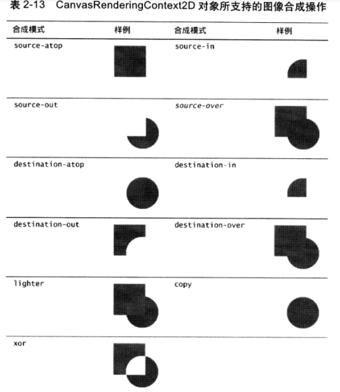

# 02.2-图像和成

通过设置 Canvas 绘图对象的 globalCompositeOperation 属性来改变默认的图像合成行为，从而实现各种各样的特效。

## 合成模式

globalCompositeOperation 支持的图像合成模式：

- source-atop
- source-in
- source-out
- source-over
- destination-atop
- destination-in
- destination-out
- destination-over
- lighter
- copy
- xor

**注意：**
chrome 与 safari 所使用的实现方式叫做“局部合成”，
在执行合成操作时，只考虑构成原图像的那些像素。
firefox 与 opera 则使用“全局合成”，在执行合成操作时，要考虑到 canvas 剪辑区域内的所有像素。

## 剪辑区域

剪辑区域是在 canvas 之中由路径所定义的一块区域，浏览器会将所有的绘图操作都限制在本区域内执行。

默认情况下，剪辑区域的大小与 canvas 一致；

可以通过创建路径并调用 canvas 绘图环境对象的 clip()方法来设定剪辑区域。
设置后的加急区域，绘制的所有内容都将局限在改区域内，在剪辑区域外进行绘制时，没有任何效果的。

## clip()方法

剪辑区域设置为当前剪辑区域与当前路径的交集，在第一次调用 clip()方法之前，剪辑区域的大小与整个 canvas 一致。

clip()方法总是在上一次的剪辑区域基础上进行操作的。

因为 clip()方法会将剪辑区域设置为当前剪辑区域与当前路径的交际，所以该方法的调用一般都是嵌入 save()与 restore()方法之间，否则，剪辑区域将会越剪越小。

## 剪辑区域实现案例

- 橡皮擦
- 伸缩式镜头动画 - 如：吞食
