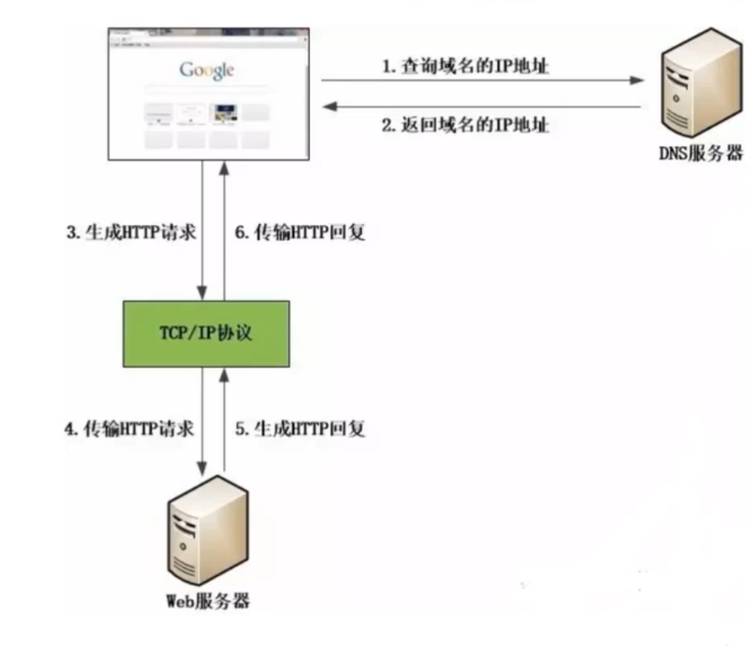
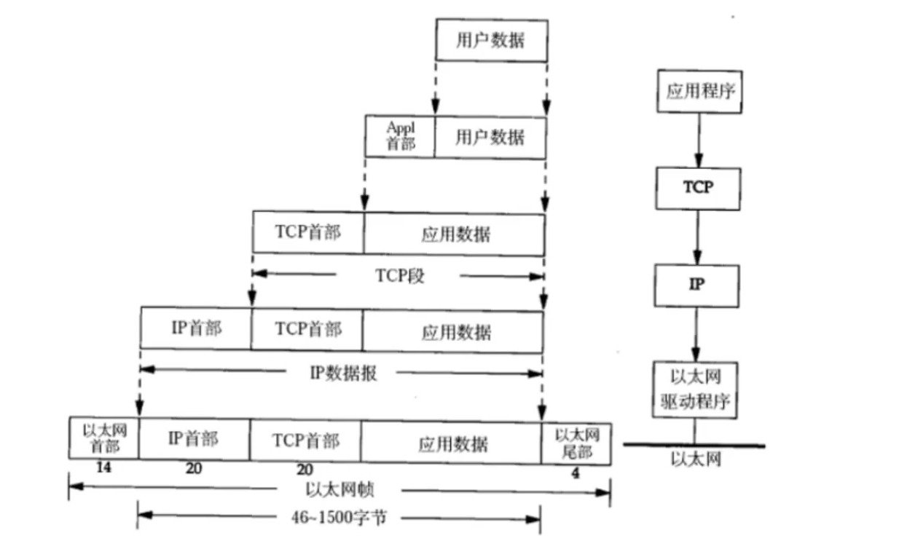
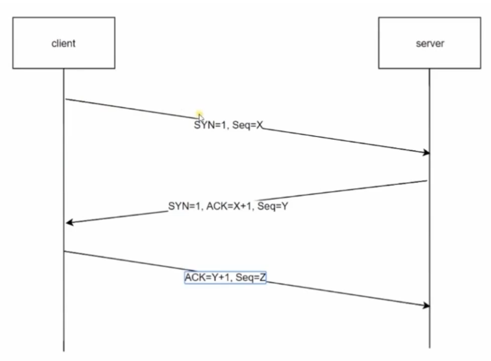
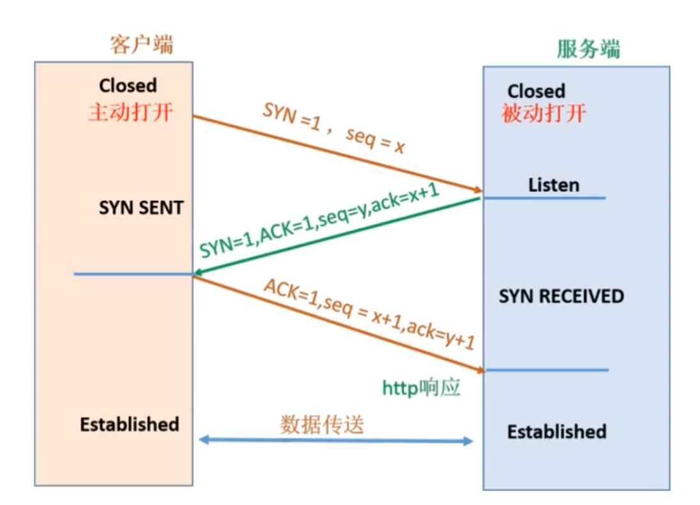

# 01- Web 开发介绍

## 一 Web 开发的本质

### 1.1 请求响应模型

客户端与服务端之间的链接是基于一种请求应答的模式。即：客户端和服务端建立一个链接，客户端提交一个请求，服务端收到该请求后返回一个响应，然后二者就会断开连接。

Web 开发，其本质其实是：

- 1. 请求：客户端发起请求
- 2. 处理：服务端处理请求
- 3. 响应：服务端返回处理结果给客户端

### 1.2 C/S 与 B/S 架构

基于请求 - 响应模型，目前的开发方式主要有两种，他们各有优劣：

- C/S 架构（Client/Server）：客户端与服务端完全分离，如：QQ、迅雷、精灵宝可梦等软件
  - 优劣：能够合理利用操作系统 API,具有较高的性能与操作体验，但新版发布会带来更新的不便
- B/S 架构（Browser/Server）：基于浏览器作为客户端的开发方式，如：招商银行官网、页游
  - 优劣：能够快速发布新版不影响用户使用，但会受限于浏览器本身的能力

## 二 网页的访问

### 2.1 DNS

服务器地址都是以 IP 的形式进行标识的，那么在浏览器中却无需直接输入 IP 地址，而是输入网址就可以访问对方服务器，这是因为有 DNS 的帮助。

DNS 服务就是用来提供域名到 IP 地址之间的转换解析服务的！

为了提升效率，DNS 服务是有缓存的，依照就近原则，来进行网址与 IP 的解析，当访问一个网址时：

- 优先从本地 host 文件中查找 ip 地址
- 然后查找本地的 DNS 缓存服务
- 去 DNS 服务商中查找

所以一个请求的真实访问过程如下所示：

### 2.1 输入 url 到网页展示的过程

假设我们点击了某网页上的一个链接，指向一个新浪体育上一个詹姆斯扣球新闻，一般网页地址为：`http://www.sina.com/sport/nba/20200203-zms.html`。

这个访问过程大致如下：

- 第一步：查找 DNS 服务
- 第二步：根据 DNS 服务查找该网页所在服务器 IP
- 第三步：浏览器与网页所在服务器建立连接
- 第四步：浏览器发出获取文件请求，服务端响应请求返回文件内容
- 第五步：浏览器与服务端双方断开连接
- 第六步：浏览器将获取到的数据通过解析引擎展示给用户

### 2.2 关于网址

URI：是一个紧凑的字符串，用来表示抽象、物理资源，可以分为 URL、URN，类似 URN 作用类似一个人的名字（身份），URL 类似一个人的地址（位置 ）。

URL 是 URI 的一种，但不是所有的 URI 都是 URL，访问机制决定了他们的不同，有访问机制的 URI 才是 URL，示例如下：

- URL：`ftp://ftp.down/1.txt`
- URI：`tel:+1-010-11-1311`

## 三 网络协议

### 3.1 网络分层

TCP/IP 协议簇是一系列网络相关协议的总称，其典型特征是分为四层结构：

- 应用层：HTTP 协议、FTP 协议等。一般是开发者编写的应用程序，直接为用户提供服务，通过系统调用和传输层进行通信。
- 传输层：TCP 协议、UDP 协议等。传输层通过系统调用向应用层提供两台计算机之间输出传输能力。
- 网络层：IP 协议。网络层用来处理网络上流动的数据报，规定通过怎样的路径到达对方计算机，并将数据报传输给对方。
- 链路层：硬件相关，也称呼为网络接口层，用来处理连接网络的硬件部分。

### 3.2 数据封包、解包

数据在网络传输时，是需要经过封包、解包的过程的。数据在经过应用程序发送时，封包的过程如下所示：

在封包时候，数据沿着协议栈，不断的在各个层加上头部信息，链路层还会额外加入尾部信息。最终数据到达互联网后，就具备了所有需识别的信息。

解包即是数据从下层传输到上层时，会逐层把下层的头部信息删除：

### 3.3 TCP 三次握手

HTTP 协议是基于 TCP 协议的上层协议，在请求响应模型中，仍然遵循三次握手、四次挥手的规范！

传输层的协议常见的有 TCP、UDP 两种。UDP 是无连接的，性能高，但是不可靠。TCP 是面向连接的，损失了一定的性能，但是更加可靠。

所谓的可靠性是指在数据传输前，发送端、接收端先互相进行验证对方的收发功能是否正常！TCP 中的验证方式是三次握手、四次挥手。

三次握手过程：

- 第一次握手：客户端发送请求报文段，内部包含 SYN 标志，发送后进入 SYN_SEND 状态，等待服务端确认
- 第二次握手：服务端接收到客户端 SYN 报文后，发送 ACK 信息对这个 SYN 报文段进行确认，同时额外发送自己的 SYN 请求信息，发送后进入 SYN_RECV 状态
- 第三次握手：客户端接收到服务端的 SYN+ACK 报文后，会向服务端发送 ACK 确认报文段，发送完毕后，客户端和服务端都会进入 ESTABLISHED 状态，三次握手完成，开始进行真实数据传输！

三次握手具体流程图：

四次挥手过程

- 四次挥手：关闭传输时，额外进行的依次握手
