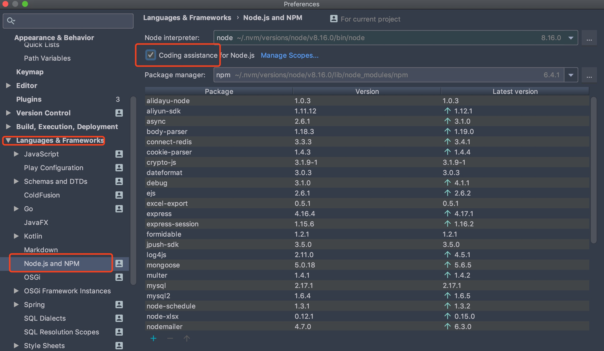

# Node 安装教程

## 一 Node 安装

Node 只需要在官网下载对应安装包下一步下一步安装即可，**默认会配置环境变量**。下载界面有两个版本：长期支持版(LTS)、Current(最新版)，建议使用 LTS 版本，当然 Node 的版本号中偶数位版本一般为稳定版，奇数位版本一般为非稳定版。

但是由于 Node 迭代速度很快，在企业开发中，经常要在多个 Node 版本中切换，使用 Node 的版本管理工具 nvm 来安装 Node，这样可以方便我们控制 Node 的版本。

> 贴士：nvm 安装也可以有效避免直接安装可能会出现的权限问题，笔者极力推荐使用 nvm 安装 Node。

### 1.1 第一步：安装 nvm

**Win 安装 nvm**：Win 上是没有 nvm 的，但是有开发者提供了类似 nvm 的工具，下载地址为：<https://github.com/coreybutler/nvm-windows/releases>

```txt
# 安装方式：下载 nvm-setup.zip 直接下一步下一步安装即可

# 安装完毕后查看是否安装成功
nvm version
```

**Linux 与 Mac** 安装：下载地址为 <https://github.com/creationix/nvm>

```txt
# 安装方式
curl -o- https://raw.githubusercontent.com/nvm-sh/nvm/v0.34.0/install.sh | bash

# 配置环境变量
vim ~/.bash_profile
export NVM_DIR="${XDG_CONFIG_HOME/:-$HOME/.}nvm"
[ -s "$NVM_DIR/nvm.sh" ] && \. "$NVM_DIR/nvm.sh" # This loads nvm
source ~/.bash_profile

# 安装后查看：
nvm version
```

注意：新版 Mac 系统默认使用 zsh 作为命令行工具，需要进行调整：

```txt
vim ~/.zshrc
setopt no_nomatch
export NVM_DIR="${XDG_CONFIG_HOME/:-$HOME/.}nvm"
[ -s "$NVM_DIR/nvm.sh" ] && \. "$NVM_DIR/nvm.sh" # This loads nvm
source ~/.zshrc

# 安装后查看：
nvm version
```

### 1.2 第二步：使用 nvm 安装 node

使用步骤:

```txt
# 可以先配置镜像地址
nvm node_mirror https://npm.taobao.org/mirrors/node/    # node镜像地址
nvm npm_mirror https://npm.taobao.org/mirrors/npm/      # node包镜像地址

# 安装最新版
nvm install latest
# 安装指定版本
nvm install 8.11.3
# 切换版本
nvm use 8.11.3
# 指定默认版本
nvm alias default 8.5.0

# 查看是否安装成功
node -v
```

## 二 开发工具配置

笔者推荐的 NodeJS 开发工具是 VScode/WebStorm。

如果是使用 VSCode 开发，推荐安装插件：

```txt
Code Runner：           用于快速右键运行 node 代码
Search node_modules：   用于 node 包快速提示
```

如果使用 WebStorme（或者 IDEA+Node 插件），则可能需要配置下 node 环境：

打开 WebStorme，在设置中界面中选择：`File-setting-Languages&Frameworks-Node`，对比下图进行勾选：


