## 一 V8 简介

V8 引擎是 Chrome 浏览器内部的 JavaScript 解释引擎，同样也是 Node 内部的 JS 解释器。V8 对内存做了一部分限制，使得 Node 无法直接操作大内存对象，64 位系统下约为 1400MB，32 位系统下约为 700MB。在单个 Node 进程中，计算机的内存资源无法得到充足的使用。

这是因为 V8 的这套内存管理机制是针对浏览器而设计的，这样的内存需求在前端页面中使用起来绰绰有余（因为每个网页选项卡都是一个 v8 实例），而在服务端开发，则在一些场合捉襟见肘。

## 二 V8 的内存分配

查看内存使用信息：

```js
var mem = process.memoryUsage();
console.log(mem);
```

输出样例：

```js
{ rss: 20824064,
  heapTotal: 7159808,           // 堆内存已申请到空间
  heapUsed: 4270176,            // 堆内存当前使用量
  external: 8224 }
```

堆的大小会随着存储的对象变多，而逐步申请新空间，增大容量，直到堆的大小超过 V8 的限制为止。表面上看，V8 对内存的限制是因为浏览器不需要使用大内存，深层原因是其实 V8 的垃圾回收机制限制。

1.5GB 堆内存的回收，V8 需要耗时 50ms 以上，而做一次非增量的垃圾回收需要 1s 以上，这是垃圾回收中引起 JS 线程暂停执行的时间，这样的时间暂停会严重影响服务器响应能力。所以 v8 直接选择限制大内存使用，就可以快速避免 GC 导致的 JS 线程暂停时间过长问题。

当然 V8 也提供了打开内存限制的配置，Node 在启动时可以传递 `--max-old-space-size` 或 `--max-new-space-size` 来调整内存限制大小：

```
node --max-old-space-size=1700 app.js       // 单位为MB
node --max-new-space-size=1024 app.js       // 单位为KB
```

## 三 V8 的垃圾回收机制

### 3.1 v8 的垃圾回收算法

v8 的垃圾回收策略基于分代式垃圾回收机制。因为不同的对象，其生存周期长短不一，一种垃圾回收算法不能完全应对所有情况，所以现在垃圾回收算法会按对象的存货时间将内存的垃圾回收进行不同的分代，然后分别对不同非带的内存使用更高效的算法。

V8 将内存设置为了 2 个分代，V8 堆的整体大小就是这 2 个分代所用的内存之和：

- 新生代：`--max-new-space-size` 参数就是设置新生代空间的最大值。
- 老生代：`--max-old-space-size` 参数就是设置老生代空间的最大值。

贴士：上述参数需要在 Node 启动时添加，即无法在启动后根据使用情况自动扩充，当内存分配中超过极限值，就会引起进程错误。

### 3.2 新生代回收

新生代垃圾回收算法是 Scavenge，而该算法的真正实现是 Cheney 算法，Cheney 采用复制的方式实现垃圾回收。
新生代堆内存被一分为二，都称呼为 semispace：

- From 空间：处于使用中
- To 空间：处于闲置状态

在分配对象说会，现在 From 空间进行分配，开始 GC 时，会检查 From 空间的存活对象，这些存活对象将被复制到 To 空间中，而非存活对象占用的空间将会被释放。完成复制后，From 空间和 To 空间的角色发生互换。简单来说，GC 就是通过将存活对象在两个 semispace 空间进行复制。

从上看出，Scavenge 算法的理论中，只能使用堆内存中的一半，但由于只会复制存活的对象，而且生命周期短的场景中存活对象往往是少部分，所以该算法仍然有很大的效率。这也是典型的牺牲空间换取时间的算法，所以无法大规模应用到所有垃圾回收过程中，只适合新生代，因为新生代对象的生命周期很短。

如图所示：


### 3.3 新生代晋升到老生代

当一个对象经过多次复制依然存活时，它会被认为是生命周期较长的对象，随后会被迁移到老生代中，这就是晋升。

晋升的条件是下列条件之一：

- 对象是否经过 Scavenge 回收
- To 空间的内存占用比超过限制（25%）。因为 Scavenge 回收完成后，To 空间转变为 From 空间，接下来内存分配在该空间进行，占比过高会影响后续内存分配




### 3.4 老生代回收

老生代中存活对象占比大，使用 Scavenge 会有 2 个问题：复制存活对象效率降低，也会出现一半空间浪费。所以 V8 在老生代使用的是 Mark-Sweep 和 Mark-Compact 相结合的方式进行垃圾回收。

Mark-Sweep：即标记清除，分为标记、清除 2 个阶段，该算法与 Scavenge 的区别是：

- 不会将内存划分为两半，所以不会造成内存空间浪费
- Scavenge 只复制活着的对象，Mark-Sweep 只清理死亡的对象。该算法标记时会遍历堆中所有对象，并标记活着的对象，在随后的清除阶段，只清除没有被标记的对象。

活对象在新生代占据较小部分，死对象在老生代只占据较小部分，这就是两个算法不同的缘由。

Mark-Sweep 的问题：在进行一次标记清除后，内存会出现不连续的情况，在后续如果要分配一个较大的对象内存时，这些碎片空间都无法完成此次分配，就需要提前触发垃圾回收，而这次回收其实是不必要的，如图所示，灰色部分为死对象：


Mark-Compact：是由 Mark-Sweep 演变而来的，用于解决上述碎片问题。他们的差别是在对象被标记位死亡后，在整理过程中，将活着的对象往一端移动，移动完成后，直接清理掉边界外的内存，如图所示完成标记并移动存活对象后的示意图，蓝色格子为存活对象，深色格子为死亡对象，浅色格子为存活对象移动后扣下的空洞。


上图中，完成移动后直接清除最右边的存活对象后面的内存区域完成回收。

### 3.5 三个算法对比

| 回收算法     | 速度 | 空间开销         | 是否移动对象 |
| ------------ | ---- | ---------------- | ------------ |
| Mark-Sweep   | 中等 | 少，有碎片       | 否           |
| Mark-Compact | 最慢 | 少，无碎片       | 是           |
| Scavenge     | 最快 | 双倍空间，无碎片 | 是           |

V8 主要使用 Mark-Sweep，在空间不足以对从新生代中晋升过来的对象进行分配时，才使用 Mark-Compact。

### 3.6 增量标记与延迟清理

在执行垃圾回收时，必须让应用程序和垃圾回收期看到的情况一致！所以，一旦执行垃圾回收，就需要将应用程序暂停，等待 GC 完成后再恢复执行应用逻辑。一般称这个过程为 Stop-the-world（全停顿）。

V8 的新生代全停顿影响很小，因为新生代配置较小，且存活对象少。

但是 V8 的老声带中，配置较大，存活对象多，全堆垃圾回收（full 垃圾回收）的标记、清理造成的停顿对用户影响较大。

为了降低停顿带来的影响，V8 在标记阶段，将原本要一次性完成的动作改为增量标记（incremental marking），即拆分为许多小步骤，每做完一个小步骤，就让 JS 应用逻辑执行一会，垃圾回收应用逻辑交替执行直到标记阶段完成。

使用增量标记后，V8 的最大停顿时间减少了原本的 1/6 左右。

V8 还存在延迟清理（lazy sweeping），增量式整理（incremental compaction），让清理、整理动作也变成了增量式。

V8 也会在未来引进并行标记、并行清理等进一步利用多核，降低停顿时间。

### 3.7 总结

V8 的堆分为：新生代（年轻分代）、老生代（年老分代）。

年轻分代的堆空间一分为二，只有一半处于使用中，另外一半用于清理垃圾。

年轻分代主要用来保存声明周期短暂的对象，例如函数中的局部变量，当函数返回，调用栈中的局部变量就会被析构掉。当 V8 发现内存空间不够时，才会进行回收。

回收步骤是：

- 将还被引用的对象复制到另一半区域；
- 释放当前一半空间，
- 把当前被释放的空间留作备用，两者角色互换。

年轻分代类似线程的栈空间，本身不太大，占用它空间的对象类似 C++中的局部对象，生命周期非常短，因此大部分都是需要被清理掉的，需要赋值对象极少，虽然牺牲了部分内存，但是速度极快。

年老分代类似 C++中使用 new 操作符在堆中分配的对象。因为这类对象一般不会因为函数退出而销毁，因此生命周期较长。年老分代的大小远大于年轻分代（32 位为 700M，64 位为 1.4GB），包含：

- 从年轻分代中移动过来的对象；
- JIT 后产生的代码；
- 全局对象。

如果年老分代采用年轻分代一样的清理算法，浪费一般空间不说，复制大块对象在时间上让人无法忍受，因此必须采用新的方式。V8 采用标记清除和标记整理的算法即将垃圾回收分为 2 个过程：

- 标记清除阶段遍历堆中的所有对象，把有效的对象标记出来，之后清除垃圾对象。因为年老分代中需要回收的对象比例极小，所以效率极高。
- 当执行完一次标记清除后，堆内存变得不连续，内存碎片的存在使得不能有效使用内存。在后续的执行中，当遇到没有一块碎片内存能够满足申请对象需要的内存空间时，将处罚 V8 执行标记整理算法：标记整理移动对象，紧缩 V8 堆空间，将碎片的内存整理为大块内存。

由于垃圾回收会阻塞 JS 代码的运行，上述两种算法是在 JS 运行时，会采取交替运行的方式，有效的减少了垃圾回收给程序造成的最大停顿时间。

## 四 查看垃圾回收日志

在 Node 启动时：

- 添加`--trace_gc`参数，即可查看垃圾回收的日志信息。
- 添加`--prof`参数，即可得到 V8 执行时的性能分析数据

但是得到的 v8.log 日志文件可读性很差，但是 v8 提供了日志统计工具，位于 Node 源码的 `deps/v8/tools`目录：

- Linux 中：linux-tick-processor v8.log
- Win 中：windows-tick-processor.bat v8.log
