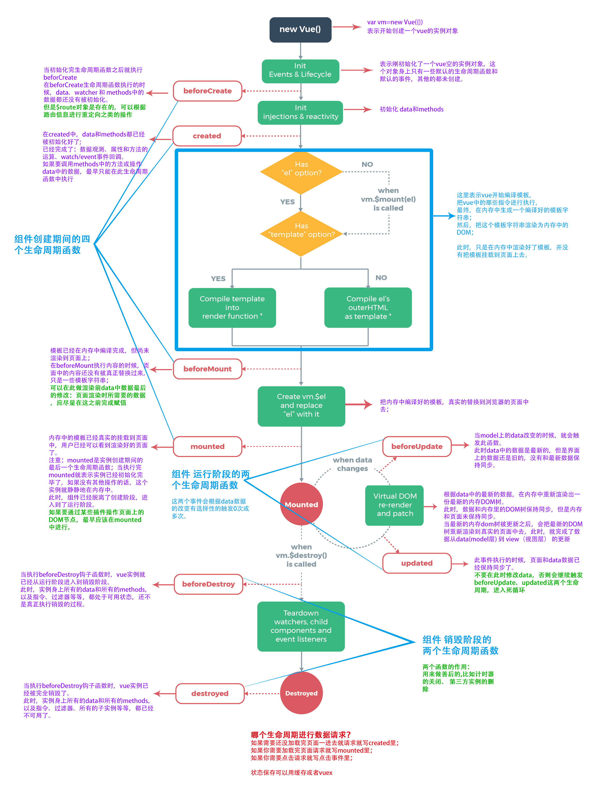

# 02-2-Vue 生命周期

## 一 Vue 生命周期

Vue 生命周期：Vue 的实例从创建、运行到销毁期间的过程即其生命周期，在此期间伴随着的各种状态改变事件，这些事件也称之为生命周期钩子函数。

如图所示：

Vue 的生命周期一般经过：创建-->挂载-->更新-->销毁几个步骤。

创建期间的初始化、挂载函数：

- beforeCreate：实例刚在内存中被创建出来，此时，还没有初始化好 data 和 methods 属性
- created：实例已经在内存中创建 OK，此时 data 和 methods 已经创建 OK，此时还没有开始 编译模板
- beforeMount：此时已经完成了模板的编译，但是还没有挂载到页面中
- mounted：此时，已经将编译好的模板，挂载到了页面指定的容器中显示

运行期间的更新函数：

- beforeUpdate：状态更新之前执行此函数， 此时 data 中的状态值是最新的，但是界面上显示的 数据还是旧的，因为此时还没有开始重新渲染 DOM 节点
- updated：实例更新完毕之后调用此函数，此时 data 中的状态值 和 界面上显示的数据，都已经完成了更新，界面已经被重新渲染好了！

销毁期间的摧毁函数：

- beforeDestroy：实例销毁之前调用。在这一步，实例仍然完全可用。
- destroyed：Vue 实例销毁后调用。调用后，Vue 实例指示的所有东西都会解绑定，所有的事件监听器会被移除，所有的子实例也会被销毁。
