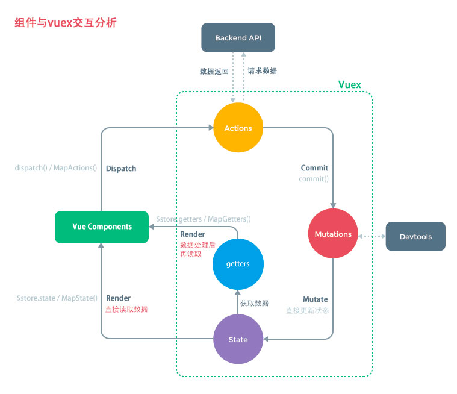

# 06-Vuex

## 一 vuex 概念

在 vue 中，不同级别组件的通信可以利用事件总线来快速实现通信，但是在大型项目中，直接使用事件总线管理这些数据相当复杂，且耦合度过高。

vuex 是 vue 的一个插件，可以对 vue 应用中多个组件的共享状态进行集中式管理（读/写）。vuex 的主要作用是状态管理，而非通信，但是由于状态管理即是数据的管理，vuex 也可以用来进行数据通信。

其实我们手动书写一个全局对象来保存数据也是可行的，类似后端的 redis，但是 vuex 还具备响应式驱动 DOM 更新的能力。

一般情况下，vuex 用来存储：登录、购物车信息、地理位置等多个界面共享的数据。

## 二 vuex 简单使用

状态自管理应用包含以下三个部分：

- `state`：应用的数据，即状态
- `view`：以声明方式将 state 映射到视图；
- `actions`：响应在 view 上的用户输入导致的状态变化(包含 n 个更新状态方法)。

```txt
# 安装(vue-cli在安装时若勾选了vuex，则无需安装)
npm i vuex -D
```

在项目根目录新建状态管理文件`store/index.js`：

```js
import Vue from "vue";
import Vuex from "vuex";

Vue.use(Vuex);

const store = new Vuex.Store({
  state: {
    // 自定义的共享状态,它应该是唯一的
    uid: 10001,
  },
  mutations: {},
  actions: {},
  getters: {},
  modules: {},
});

export default store;
```

在组件中使用：

```txt
<p>{{this.$store.state.num}}</p>
```

## 三 vuex 的核心概念和 API

### 3.1 state

vuex 管理的状态对象，里面会包含一些具体的状态，也即通用的数据，如登录信息、购物车信息、地理位置信息。

示例：

```js
  state: {            // 自定义的共享状态,它应该是唯一的
    uid: 10001
  },
```

state 保存的数据推荐使用 单一状态树 的形式，即大量的不同的数据都统一使用一个 store，而不是多个 store 对象。在这唯一的 store 中，进行数据的树形划分。

### 3.2 mutations

vuex 并不推荐直接修改 state 数据，而是通过一个机制来进行状态更新，如图所示：



组件要更新数据时，依次经过： actions -> mutatiosn -> state，这样的路径进行修改。

为什么要绕一大圈？

在当前一个页面中，状态发生了变化，并不知道其来自于哪个地方触发了状态改变，调试很困难。 vue 的开发工具 Devtools 可以在浏览器中清晰的展示是哪个组件的更新导致了状态的变化，该工具依赖于 mutations ，所以我们使用 mutations 中状态更新的方法来改变状态。

mutations：

```js
  state: {
    num: 10
  },
  mutations: {
    updNum(state){     // 默认有一个参数 state
      state.num++
    }
  },
```

在组件中使用：

```html
<template>
  <div id="app">
    <p>{{this.$store.state.num}}</p>
    <button @click="doUpdNum">改变num</button>
  </div>
</template>

<script>
  export default {
    data() {
      return {};
    },
    methods: {
      doUpdNum() {
        this.$store.commit("updNum"); // commit
      },
    },
  };
</script>
```

mutations 包含 2 个部分：

- 回调函数：即 mutations 内部定义的某个方法，第一个参数默认是 state
- 事件类型：即该方法的方法名，在组件中调用该方法时使用该方法名字符串

mutations 中传递参数的方式：

```js
  state: {
    num: 10
  },
  mutations: {
    updNum(state, count){     // 默认有一个参数 state
      state.num += count
    }
  },
  getters: {
    getNum(state){
      return state.num + 5
    }
  },
```

组件中展示：

```html
<template>
  <div id="app">
    <p>原始数据：{{this.$store.state.num}}</p>
    <button @click="doUpdNum(10)">改变num</button>
    <p>getters数据：{{this.$store.getters.getNum}}</p>
  </div>
</template>

<script>
  export default {
    data() {
      return {};
    },
    methods: {
      doUpdNum(count) {
        this.$store.commit("updNum", count);
      },
    },
  };
</script>
```

mutations 还有一种提交风格：

```js
this.$store.commit({
  type: "updNum",
  count: 100,
});
```

### 3.3 actions

mutations 中推荐保存 同步 操作，而 actions 中推荐保存 异步 操作。

如果不按照这个规范，Devtools 工具也会出现跟踪问题。

actions 示例：

```js
  state: {
    num: 10
  },
  mutations: {
    updNum(state, count){     // 默认有一个参数 state
      state.num += count
    },
    updNumAsync(state, count){
      state.num += count + 3000
    }
  },
  actions: {
    updNumAsync(context, count){     // 默认参数为context上下问对象，这里是 store对象
      setTimeout(() => {
        context.commit('updNumAsync', count)
      }, 2000)
    }
  },
```

组件中使用：

```html
<template>
  <div id="app">
    <p>原始数据：{{this.$store.state.num}}</p>
    <button @click="doUpdNum(10)">同步改变num</button><br />
    <button @click="doUpdNumAsync(10)">异步改变num</button>
  </div>
</template>

<script>
  export default {
    data() {
      return {};
    },
    methods: {
      doUpdNum(count) {
        this.$store.commit("updNum", count);
      },
      doUpdNumAsync(count) {
        this.$store.dispatch("updNumAsync", count);
      },
    },
  };
</script>
```

### 3.4 getters

类似 vue 中的计算属性，在这里可以对获取到 state 数据进行修饰。

```js
  getters: {
    getNum(state){
      return state.num + 5
    }
  },
```

组件中使用：

```txt
<p>{{this.$store.getters.getNum}}</p>
```

### 3.5 modules

由于 vuex 推荐使用单个状态树，状态过多也很容易造成混乱，modules 可以将这些状态进行划分。每个 modules 就是一个 store 的配置对象，一般与一个组件对应：

```js
  modules: {
    moduleA: {
      state:{},
      mutations:{}
    },
    moduleB: {
      state:{},
      mutations:{}
    }
  }
```

在组件中使用：

```txt
this.state.moduleA.num
```

## 四 vuex 的响应规则

Vuex 的 store 中的 state 是响应的，当 state 数据发生改变时，组件中的数据也会发生改变，不过 store 中必须 初始化好所需要的属性 ！

给 state 对象添加新属性时，此时 state 中新增了数据，但是界面是不会发生变化的，使用下面的方式可以进行响应

- 方式一：给 state 的 person 对象新增 age 属性：
  - `Vue.set(state.person, 'age', 26)`
  - 删除也可以做到响应：`Vue.delete(state.person, 'age')`
- 方式二：用新对象给旧对象重新赋值

## 五 状态相关文件的组织格式

由于状态文件极大，可以对其分模块使用，store 文件夹中使用下列文件：

- index.js：store 的导出信息
- mutations.js：数据更新方法文件
- acitions.js：数据异步更新方法文件
- ....依次类推，每个 vuex 的属性单独一个文件保存

示例：

```js
// actions.js
export default {
  updNumAsync(context, count) {
    // 默认参数为context上下问对象，这里是 store对象
    setTimeout(() => {
      context.commit("updNumAsync", count);
    }, 2000);
  },
};

// index.js
import actions from "./actions";

const store = new Vuex.Store({
  actions: actions,
});
```
