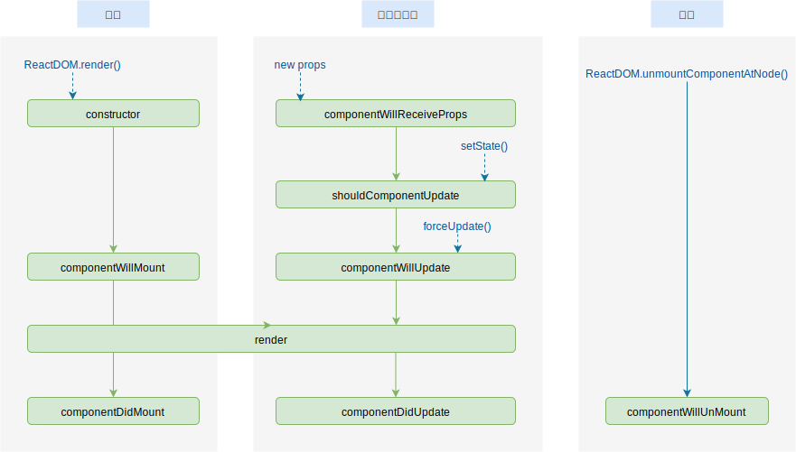
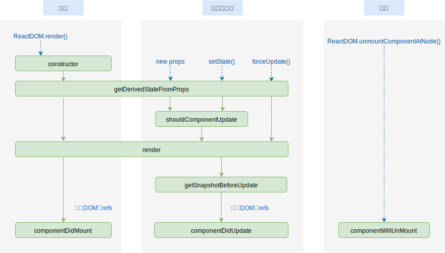

# 07.1-React 生命周期

## 一 生命周期概念

组件的创建、加载、销毁等过程，总是伴随着各种各样的事件，这些特定的时期，以及触发的事件，被称为生命周期。

组件的生命周期分为三部分：

- 挂载：即创建阶段，其相应生命周期函数只会执行一次；
- 运行：运行阶段会根据组件的 state 和 props 的改变，有选择的触发一些函数；
- 销毁：销毁阶段的生命周期函数只会执行一次。

## 二 旧版生命周期

### 2.0 旧版生命周期钩子函数

不同的生命周期内都对应了一些钩子函数，如图所示：



### 2.1 旧版生命周期-组件创建阶段

创建阶段是组件的第一次渲染，由 `ReactDOM.render()` 触发，包含四步：

```txt
第一步： constructor() 设置原始数据
    该阶段用于设置原始的私有数据： this.state = {}，因为该部分为位于构造函数，
    不过也会优先初始化默认的props值：static defaultProps = {}，用来防止组件一些必须的属性在外界没传递时报错。

第二步： componentWillMount() 组件即将被挂载
    此时组件的虚拟DOM元素尚未创建完毕（因为是在render中创建）

第三步： render()   生成虚拟 DOM
    render()方法运行完毕后，虚拟DOM也创建完毕，但是并未真正挂载到真实的页面上

第四步： componentDidMount() 组件已经挂载，即显示到了真实页面上
    表示组件已经完成了挂载，state 上的数据、内存中的虚拟 DOM、浏览器的页面都已经保持了一致，组件进入到了运行阶段。
    该阶段较为常用，由于此阶段组件已经真实渲染，可以在钩子内开启定时器、发送网络请求、订阅消息·等。
```

### 2.2 旧版生命周期-组件运行阶段

运行阶段，属性 props 的改变，状态 state 的改变都可以触发组件的更新。

由 `setState()` 、`父组件.render()` 触发更新：

```txt
第一步：  shouldComponentUpdate() 判定组件是否需要更新
    该钩子函数是能否能改状态的阀门，该函数返回 true 才能执行更新。

第二步：  componentWillUpdate() 组件将要更新
    此时内存中的虚拟DOM树还是旧的

第三步：  render() 生成新的虚拟DOM
    重新根据最新的state和props重新渲染DOM树于内存中，render调用完毕后，内存中旧DOM树被新的DOM树替换了，此时页面还是旧的

第四步：  componentDidUpdate()  重新渲染
    新的state、虚拟DOM与页面都保持了同步
```

注意：父组件在再次渲染（第二次 render）的时候，会额外触发钩子：`componentWillReceiveProps()`用来证明父组件给当前子组件传递了新的属性值。

贴士：通过强制更新（forceUpdate）绕过阀门控制，不更改状态也更新组件。

### 2.3 旧版生命周期-组件销毁阶段

组件销毁即组件卸载。

由 `ReactDOM.unmountComponentAtNode()` 触发：

```txt
第一步：  componentWillUnmount() 组件将要被销毁
    此时组件还能正常使用，一般用于做收尾的事情，如：关闭定时器、取消订阅
```

## 三 新版生命周期

### 3.0 新版生命周期钩子函数

新版生命周期钩子函数如图所示：



在新版生命周期中，有三个旧钩子不再被推荐使用，即`componentWillMount`、`componentWillUpdate`、`componentWillReceiveProps`。React 为这三个函数分别额外提供了一个在新函数，即原函数名上添加了`UNSAFE_`前缀的函数，在 React18 中，只有带该前缀的钩子函数可以使用。因为 React 官方认为这三个函数经常被滥用，且在异步渲染中更容易出现错误。

在新版生命周期中，提出了 2 个不常用的新钩子：

- `static getDeriveStateFromProps(props, state)`：此方法只用于组件状态与 props 一致的场景，即该方法能够通过 props 派生并返回状态对象。但该钩子函数会造成代码冗余，笔者认为极度鸡肋！
- `getSnapshotBeforeUpdate()`：可以在更新发生前捕获一些信息（快照），其返回值将作为参数传递给下游钩子 `componentDidUpdate()`。使用场景如：获取滚动位置。

### 3.2 新生命周期个阶段对应钩子总结

创建阶段：

```txt
第一步：  constructor()
第二步：  getDerivedStateFromProps
第三步：  render()
第四步：  componentDidMount()
```

更新阶段：

```txt
第一步：  getDerivedStateFromProps()
第二步：  shouldComponentUpdate()
第三步：  render()
第四步：  getSnapshotBeforeUpdate()
第五步：  componentDidMount()
```

销毁阶段：

```txt
第一步：  componentWillUnmount()
```
