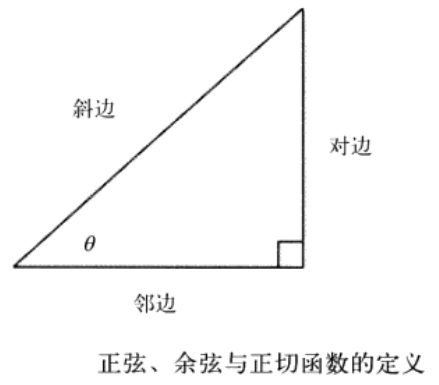
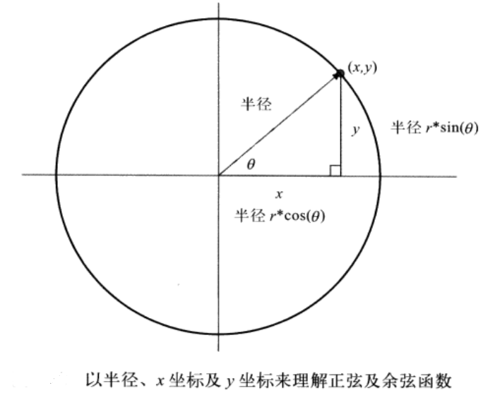
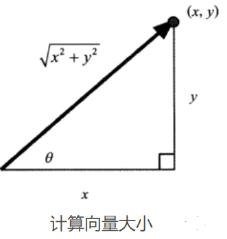
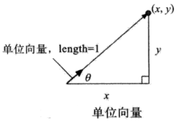
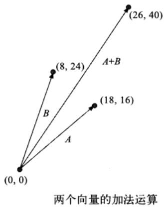
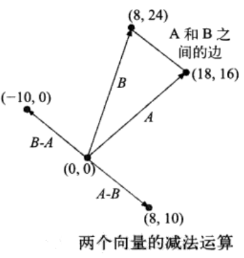

# 基础数学知识


## 三角函数
### 1.1 角的度量：角度与弧度
- 180度 = π弧度
- 1弧度 = (π / 180) * 度
- 1度 = (180 / π) * 弧度

javaScript的 Math.sin()、 Math.cos()、 Math.tan() 函数也都采用弧度值

### 1.2 正弦、余弦、正切函数
-正弦： sin(θ) = 对边/斜边
-余弦： cos(θ) = 邻边/斜边
-正切： tan(θ) = 对边/邻边



### 1.3 向量运算
#### 1.3.1 向量的大小
任何直角三角形的斜边，等于另外两边平方和的平方根


javaScript代码：
```js
 // 从一个名为vector的向量引用中计算出该向量的大小
 var vectorMagnitude = Math.sqrt(Math.pow(vector.x , 2) + Math.pow(vector.y , 2))

```

#### 1.3.2 单位向量
长度永远是 “单位1” 的向量


javaScript代码：
```js
// 根据一个名为vector的向量，计算出该向量的大小；然后创建一个新的unitVector对象，并将原有向量的x与y值分别除以原向量的大小，作为这个新向量的x与y值
var vectorMagnitude = Math.sqrt(Math.pow(vector.x , 2) + Math.pow(vector.y , 2));
var unitVector = new Vector();
unitVector.x = vector.x / vectorMagnitude;
unitVector.y = vector.y / vectorMagnitude;

```

#### 1.3.3 向量的加法与减法
如果有两个力同时作用于某个物体，可以把代表这两个力的向量相加，计算出这两个力的合力。
同样，也可以从一个方位向量之中减去另一个，以求得两点之间的边界。




**向量的加法/减法运算：**将向量的两个分量分别 相加/相减

```js
var vectorSum = new Vector();

// 加法
vectorSum.x = vectorOne.x + vectorTwo.x;
vectorSum.y = vectorOne.y + vectorTwo.y;

// 减法
vectorSum.x = vectorOne.x - vectorTwo.x;
vectorSum.y = vectorOne.y - vectorTwo.y;
```

#### 1.3.4 两个向量的点积
计算两个向量的点积，需要将两个向量的对应分量相乘，然后再将乘积相加。


点乘的几何意义和用处就是计算两个向量之间的夹角，以及在某一方向上的投影。

```js
var docProduct =  vectorOne.x * vectorTwo.x + vectorOne.y * vectorTwo.y;
```

注意： 点积不是向量，而是叫做 “标量” ， 它仅仅是一个数字。

- 如果两个向量的点积大于0，意味着两个向量大概处在同一个方向上；
- 如果两个向量的点积是0，则其必定相互垂直